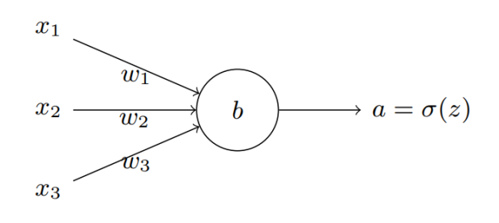
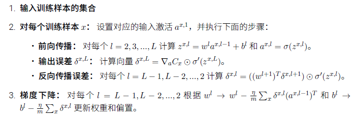

# 简单神经网络

## 反向传播与交叉熵代价函数

引入交叉熵代价函数：

$C=-\frac{1}{n}\sum_{x}[y\ln a + (1-y)\ln (1-a)]$

对求求导得到梯度：

$\frac{\partial C}{\partial w_j} = \frac{\partial C}{\partial a} \frac{\partial a}{\partial z} \frac{\partial z}{\partial w_j} = [-\frac{y}{a}+\frac{1-y}{1-a}] *[ (1-a)*a]*x_j =（a-y）*w_j$

$\frac{\partial C}{\partial b} = a-y $

所以利用梯度下降法更新参数时：

$w_j' =w_j - \eta* \frac{\partial C}{\partial w_j} $

$b' =b - \eta* \frac{\partial C}{\partial b}$

在取每个小样本时代价函数可以用每一个训练样本代价函数的均值表示：

$w_j' =w_j - \frac{\eta}{m}*\sum^m_{j}\frac{\partial C}{\partial w_j} $

$b' =b - \frac{\eta}{m}*\sum^m_{j} \frac{\partial C}{\partial b}$

反向传播的四个**基本方程**：

定义第$l$层第$j$个神经元上的误差为为$\delta_{j}^{l}$,    $ \delta_{j}^{l}=\frac{\partial C}{\partial z^L_j}$

1. 输出层误差方程：

	$\eta^L_j = \frac{\partial C}{\partial a^L_j} * \sigma'(z^L_j)$

2. 下一层表示该层误差：

	$\delta ^l =((w^{l+1})^T\delta^{l+1})\odot\sigma'(z^l)$ 

3. 代价函数关于任意偏置的改变率：

	$\frac{\partial C}{\partial a^L_j} = \delta^l_j$

4. 代价函数关于任何权重的改变率：

	$\frac{\partial C}{\partial w^l_{jk}} = a^{l-1}_k \delta^l_j$ 

